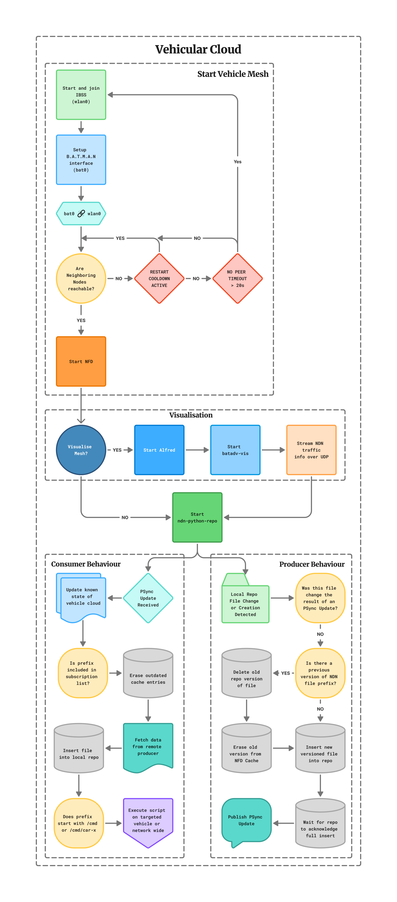

# V2V Cloud Sync Toolkit

This repository contains a set of C++ and Python utilities that automate file
propagation between vehicles by combining
[ndn-python-repo](https://github.com/usnistgov/ndn-python-repo) storage with
[PSync](https://github.com/named-data/PSync) notifications. Files that are
edited inside the watched directory on the "cloud" node are inserted into the
local repo, versioned, announced via PSync, and then fetched by remote
consumers.

A short demo video of the system in action is available in the companion
repository: [brewski/Vehicle-Cloud](https://github.com/Brewski7/Vehicle-Cloud).

## Repository layout

| Path | Description |
|------|-------------|
| `psync-start.cpp` | Listens for PSync state updates, validates subscription rules (`subsfile`), and triggers repo fetches for new content. |
| `psync-update.cpp` | Publishes PSync updates for a given prefix once the repo has been updated. |
| `update-repo-file.py` | Watches the configured file hierarchy (BMW dataset folders by default), rewrites updated files into the repo, clears stale cache entries, and sends PSync notifications. |
| `putfile.py` / `delfile.py` | Thin wrappers around ndn-python-repo CLI insert/delete operations that add timestamped versions. |
| `getfile.py` / `get-latest.py` | Client helpers for fetching a specific version or the newest timestamped asset from the repo. |
| `repo_utils.py` | Shared helpers for querying the repo SQLite database. |
| `start-cloud.sh` / `stop-cloud.sh` | Convenience scripts to launch and tear down the repo watcher, PSync binaries, and repo service. |
| `subsfile` | Optional newline-separated list of prefixes that `psync-start` is allowed to fetch. |

## System architecture overview

The following diagram illustrates the internal PSync–Repo coordination flow,
showing how file updates are detected, versioned, and propagated between nodes.

<p align="center">
  <a href="docs/Design_2.png">
    
  </a>
</p>

## Prerequisites

### NDN/PSync toolchain

* `libndn-cxx` and `PSync` development packages (available via `pkg-config`).
* `ndn-python-repo` installed and on the `PATH`.
* `nfdc` (part of [NFD](https://named-data.net/doc/NFD/current/)) for cache
  management.

The C++ utilities are built against these libraries via `pkg-config` and assume
that a working NDN forwarder is running on the local machine.

### Python environment

Python 3.10+ with the following packages:

* `ndn-python-repo`
* `python-ndn`
* `watchdog`
* `termcolor`

All scripts use the system interpreter (`python3`). `update-repo-file.py`
additionally relies on SQLite access to the repo database that is stored inside
`~/.ndn/ndn-python-repo/sqlite3.db`.

## Building the PSync helpers

Compile the binaries by running:

```bash
make
```

This builds both `psync-start` and `psync-update`. Use `make clean` to remove
the generated executables.

## Configuration

* **Watched directory** – `update-repo-file.py` auto-detects whether the code is
  running on a laptop or Raspberry Pi using the presence of
  `/home/brewski/masters`. The active tree is stored in `WATCH_DIR` inside the
  script and defaults to `~/bmw` on devices without the fallback path.
* **Repo name** – By default files are inserted under `/bmw` in the
  ndn-python-repo instance.
* **Sync prefix** – Both PSync applications use the `psync` prefix to share
  state across nodes.
* **Allowed fetch prefixes** – Populate `subsfile` with prefixes that remote
  vehicles may download (one prefix per line). `psync-start` reads this file at
  start-up.

Adjust these values if you are running the system in a different environment or
under different naming conventions.

## Running the system end-to-end

1. **Start NFD** (if it is not already running).
2. **Launch the cloud stack** on the producer node:
   ```bash
   ./start-cloud.sh
   ```
   The script clears previous processes, wipes cached repo state, starts
   `ndn-python-repo`, spawns `update-repo-file.py`, and finally launches the
   `psync-start` listener.
3. **Edit or add files** inside the watched `bmw/` directory tree. Each change is
   debounced, written into the repo with a fresh timestamp, and advertised via
   PSync.
4. **Remote vehicles run `psync-start`** (or the compiled binary distributed to
   them). Upon receiving an update for an allowed prefix they fetch the latest
   file via `getfile.py` and update their local copy.
5. **Stop the stack** when finished:
   ```bash
   ./stop-cloud.sh
   ```

## Useful commands

* Manually insert a file into the repo:
  ```bash
  python3 putfile.py -r /bmw -f /path/to/file -n /bmw/path/to/file
  ```
* Notify listeners about a repo entry without editing the file watcher:
  ```bash
  ./psync-update psync /bmw/path/to/file
  ```
* Fetch the newest version of a file:
  ```bash
  python3 get-latest.py -r /bmw -n /bmw/path/to/file
  ```
* Fetch a specific version (with timestamp component):
  ```bash
  python3 getfile.py -r /bmw -n /bmw/path/to/file/t=1693940000000
  ```

## Logging and performance measurements

Both the C++ listener (`psync-start`) and the repo watcher maintain per-prefix
performance logs in `~/perf_logs/`. These timestamped entries capture when
updates are detected, inserted, and fetched, which is useful for measuring
propagation latency across the V2V network.

## Troubleshooting tips

* Ensure `nfdc cs erase /` succeeds so the latest repo content is not served
  from stale cache entries.
* When files fail to appear in remote repos, inspect the watcher output to see
  whether `update-repo-file.py` skipped the event because it was marked as
  fetched locally (synchronization happens over a UNIX domain socket).
* Verify that the prefixes listed in `subsfile` match the prefixes inserted into
  the repo; otherwise the consumer will ignore the update.
